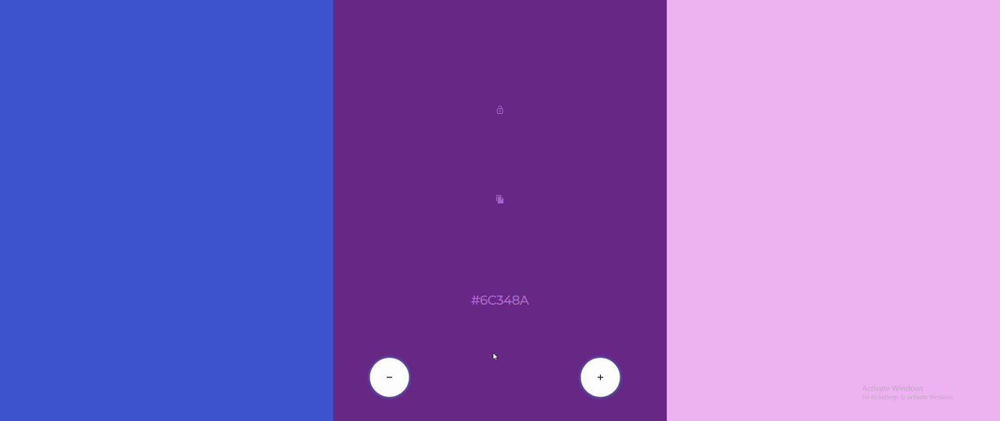

#Colors2Palette
The simple color palette generator built in React.js

 / 

### What is this?
This is a tool I built as resource for my works design team/ to use on their front facing website

### How I built this?
I used React.js with hooks to build this single page application

##### Why isnt it responsive?
This tool was designed to be desktop only so responsive design wasnt at the forefront of development times